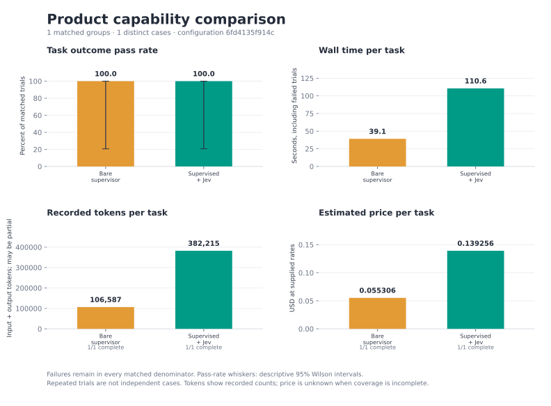

# Cerebro evals

<!-- evals:overview:start -->

[Latest published results](results/2026-10-03-happy-path-jev/report.md)

Configuration `6fd4135f914c`: **Bare supervisor model 1/1; Supervisor + implementor + reviewer + Jev 1/1** shared task outcomes; Bare supervisor model → Supervisor + implementor + reviewer + Jev **+0.0 percentage points**. 1 matched groups across 1 distinct cases; 0 incomplete units excluded. Small selected local implementation fixtures; descriptive results.

Models and efforts: implementation `gpt-6-luna` (low); review `gpt-5.6-terra` (medium); supervisor `gpt-5.6-terra` (medium).

| Condition | Passed / trials | Mean seconds | Mean estimated USD |
| --- | ---: | ---: | ---: |
| Bare supervisor model | 1/1 | 39.1 | 0.0553 |
| Supervisor + implementor + reviewer + Jev | 1/1 | 110.6 | 0.1393 |



<!-- evals:overview:end -->

The [Terra pilot](results/2026-10-03-terra-pilot/report.md) and its
[interpretation](results/2026-10-03-terra-pilot/interpretation.md) describe the
previous workflow. They remain historical evidence; the five-condition protocol
below is a different experiment.

## Run a comparison

From the repository root, create an isolated Python environment and edit
[model-config.example.json](model-config.example.json) for your available models:

```sh
python3 -m venv evals/.venv
evals/.venv/bin/python -m pip install -r evals/requirements.txt
```

Python 3.9+, Bash, Git and `jq` are required. Live trials require an installed,
authenticated Codex CLI and consume provider tokens. Live model-quality evals
currently support **Codex only**; the Cerebro product supports Pi, Codex and
Claude. Protocol fixtures test native transports without live inference.
Jev conditions also require `CEREBRO_JEV_API_KEY` or `jev_api_key` in Cerebro's
config; environment settings override the configured endpoint, model and
confidence. Missing providers fail the run rather than substituting fixtures.

Each command creates a new private output directory:

```sh
# Default smoke: three tasks, five conditions each (15 trials).
evals/.venv/bin/python evals/run.py --config evals/model-config.example.json --out /tmp/cerebro-smoke-new

# All task comparisons, static review calibration and offline protocol cases.
evals/.venv/bin/python evals/run.py --suite all --config evals/model-config.example.json --out /tmp/cerebro-all-new

# Static review calibration, with and without advisory Jev assessment.
evals/.venv/bin/python evals/run.py --suite reviews --config evals/model-config.example.json --out /tmp/cerebro-reviews-new

# Offline native lifecycle contracts; no model settings or credentials needed.
evals/.venv/bin/python evals/run.py --suite protocol --out /tmp/cerebro-protocol-new
```

Smoke covers complete code and executable-documentation delivery, legitimate
domain investigation, and a two-module JSON job queue with persisted state,
transition and ownership requirements. Hidden checks exercise behavior beyond
supplied tests. These are small local fixtures, not broad software-engineering
benchmarks. `--suite all --list` shows the current catalogue: task comparisons
cover delivery, truthful blockers, review recovery, scope and workspace reuse;
static reviews cover supported, false, incomplete, clean and injected claims;
protocol cases cover completion, answer/resume, failure, interruption, steering,
cancellation/disconnect ownership and restart.

The separate `comparison-lease-queue-concurrency` case tests whether a repair
keeps a JSON-backed lease queue correct across long-lived instances and
simultaneous POSIX processes. Its hypothesis is that concurrency and ownership
failures require coordination across the full read-modify-write path, including
exact lease expiry and stale owners. The initial exploratory group uses three
conditions, Luna (low) for implementation and Terra (medium) for review and
supervision, with a 300-second task timeout:

```sh
evals/.venv/bin/python evals/run.py --config evals/model-config.example.json \
  --case comparison-lease-queue-concurrency \
  --conditions bare_supervisor supervisor supervisor_jev \
  --implementation-model gpt-6-luna --implementation-effort low \
  --review-model gpt-5.6-terra --review-effort medium \
  --supervisor-model gpt-5.6-terra --supervisor-effort medium \
  --timeout 300 --jobs 1 --seed 42 --out /tmp/cerebro-lease-queue-2026-10-03
```

`--case ID` is repeatable and replaces the smoke selection within the chosen
suite. `--suite comparison` selects only task comparisons. `--repeat N` repeats
cases, `--seed N` counterbalances arm order, and `--timeout N` bounds each native
stage. Repetitions do not add independent task diversity.

## Conditions and role settings

| CLI condition | Coding role | Independent review | Supervisor | Jev |
| --- | --- | --- | --- | --- |
| `bare_implementor` | implementation | none | none | off |
| `bare_supervisor` | supervisor | none | none | off |
| `implementor_reviewer` | implementation | review role | none | off |
| `supervisor` | implementation | review role | supervisor role | off |
| `supervisor_jev` | implementation | review role | supervisor role | watches implementation and assesses findings |

Arms share initial requirements, source and prior task evidence. Bare conditions
make model-strength comparisons explicit. The implementor codes and tests; the
reviewer reports original findings. The `implementor_reviewer` condition gets
**one predetermined task packet plus review**, with no supervisor planning or
correction loop.
Supervisor conditions plan, adjudicate findings and may request up to two
focused correction tasks. Jev remains advisory. There is no verifier agent,
mandatory plan/spec ceremony or tool guard in this protocol.
Workspace cases leave checkout decisions to each condition; the harness does not
pre-plan a worktree for the one-pass condition. Refusals and unfinished workspace
work remain failures rather than being repaired by the harness.
Related-branch reuse supplies the same selected checkout to every arm; it measures
reuse and preservation of original edits, rather than checkout discovery.

There is no built-in model catalogue or coding-role model/effort default. The
example's Luna/Terra choices are editable configuration, not product defaults.
JSON `defaults.models` and `defaults.efforts` use the role keys `implementation`,
`review`, and `supervisor`; `cases` supplies the same shape keyed by exact case
ID. Precedence is **config defaults < per-case config < CLI overrides**.

Instead of a config file, supply `--implementation-model`, `--review-model`
and `--supervisor-model`; corresponding `--implementation-effort`,
`--review-effort` and `--supervisor-effort` flags are optional. Live task
comparisons require all three model choices; static reviews require only the
supervisor model. Omitted efforts preserve native defaults. Names and efforts
pass through without a catalogue or silent substitution. Requested settings and
native resolution evidence are recorded separately; aliases may resolve to a
different native identifier.

For comparison runs without Jev, select
`--conditions bare_implementor bare_supervisor implementor_reviewer supervisor`.
This flag changes task-comparison conditions; static review calibration still
includes its Jev condition.

`--jobs 1` is the default and measures isolated trial latency. Higher values cap
concurrent **case/repeat groups**, each in a spawned process. Arms within each
group run sequentially in counterbalanced order. Parallel timings measure shared
machine/provider load, not isolated latency. Trials have separate checkouts and
native/Cerebro homes. The manifest records requested/effective concurrency and
timing mode; cohorts separate concurrency, role settings, Jev settings and time
budget. Reports are aggregated by the coordinator. Interrupted runs retain
receipts and failure denominators; unstarted trials have no timed/usage sample.
The runner has no cache or resume framework.

## Outcomes and evidence

`task_success` is the common delivery outcome: hidden behavior checks, preserved
scope/checkouts, final-source executed tests and truthful **model-authored**
completion, runtime and blocker claims. Stage completion alone proves no
acceptance criterion. Bare arms need no Cerebro artifacts to pass.

`condition_valid` separately measures compliance with assigned models,
monitoring, delegation and independent review of delivered source.
`role_separated_success` combines delivery and condition validity for delegated
arms; it is not measured for bare arms. A supervisor that codes directly or skips
review can deliver working code while failing the condition diagnostic.
`ambiguous_source_ownership` records edits whose supervisor/child ownership
cannot be established; uncertainty is not successful role separation. Static
review decisions and Jev classification scores remain separate from task
outcomes. Failures and unfinished work stay visible.

Each trial writes a durable `result.json` before coordinator delivery. Keep
original receipts and run a new experiment rather than editing recorded evidence.
Private runs include native events, source-bound checks, original model replies,
Jev request/response traces and source/configuration fingerprints. Completed
receipts survive interruption; missing work receives an explicit failure record.

Usage totals count native conversation totals once and retain per-provider/role
coverage. Cached input/write counts are input subsets. Partial token evidence is
reported as partial; missing usage or pricing remains **unknown**, never zero.
[Reference rates](prices-2026-10-03.json) are dated API estimates, not account
bills; `--prices FILE` selects another dated rate sheet.

## Publish and inspect

Publish directly after a run:

```sh
evals/.venv/bin/python evals/run.py --config evals/model-config.example.json \
  --out /tmp/cerebro-publish-new --publish evals/results/my-smoke
```

Or publish existing private receipts without rerunning providers:

```sh
evals/.venv/bin/python evals/publish.py /tmp/cerebro-smoke-new \
  --out evals/results/my-smoke-published --prices evals/prices-2026-10-03.json
```

Publication creates sanitized Markdown, SVG/PNG charts, aggregate statistics and
an allowlisted trial dataset in a **new, immutable directory**. It excludes
private logs, prompts, source, paths, credentials, endpoints and provider prose.
`run.py --update-readme` updates only this overview block when used with
`--publish`; `publish.py --readme evals/README.md` does the same for saved results.
Historical result directories are never overwritten.

Only complete matched arm groups enter paired comparisons; failed trials remain
in those denominators and missing arms are listed separately. Reports use Wilson
descriptive intervals. Case-bootstrap intervals require ten distinct cases;
smoke results cannot establish general advantage or statistical significance.

Offline checks:

```sh
PYTHONPATH=evals evals/.venv/bin/python -m unittest discover -s evals -p 'test_*.py' -v
```
