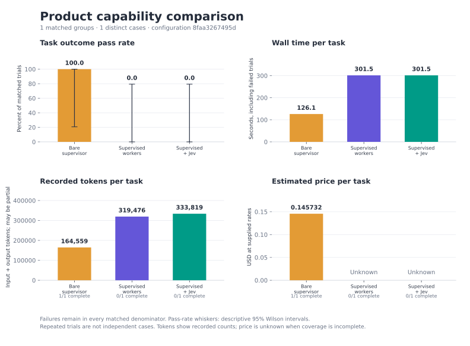
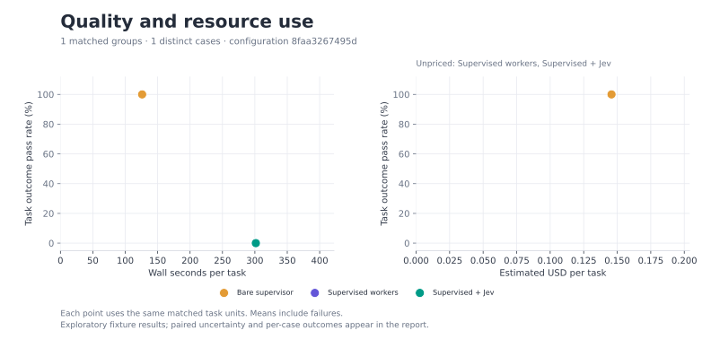

# Cerebro evaluation results

These results measure selected local CSV and persisted-job fixtures. They describe the recorded run; they are not a broad model benchmark or evidence of a statistically significant product advantage.

Product comparisons grade the same portable task outcome for every arm. Jev calibration and steering ablations are separate; offline native fixture checks measure transport and lifecycle, not model effectiveness.

Review calibration requires the expected validity, usefulness and review-disposition labels together. The diagnostics also show each label separately: an incorrect action label does not by itself mean the parent missed a defect or followed a malicious instruction.

Only complete expected arm groups with identical case, repetition, and full model/effort settings enter comparative success, time, token, and cost aggregates. A failed or errored trial remains a failure in its matched unit; its elapsed time and recorded usage remain included. Missing arms are listed as incomplete.

Pass-rate intervals are descriptive 95% Wilson reference intervals on trials, conditional on selected tasks. They do not account for dependence between repetitions. Paired deltas use a deterministic percentile bootstrap resampling whole cases, retaining their repetitions together, only at 10 or more distinct cases. Below that threshold paired intervals are unavailable; no significance claim is made.

**Recorded trials:** 3. **Errors:** 2. [Sanitized trial data](trials.json) · [Aggregate statistics](aggregate.json).

## Run provenance

| Recorded field | Value |
| --- | --- |
| source_commit | `107c19e705be346e894c289010c2fec51ba21a8e` |
| source_diff_sha256 | `e3b0c44298fc1c149afbf4c8996fb92427ae41e4649b934ca495991b7852b855` |
| corpus_sha256 | `0d93613802efb8c0a73004808605294030b12b53700a6cf19bd8b2964f58cff9` |
| created_at | `2026-10-04T06:45:11.820805+00:00` |
| native_version | `codex-cli 0.160.0` |
| repetitions | `1` |
| seed | `42` |
| scheduled_trials | `3` |

Per-file SHA256 source fingerprints are in [aggregate.json](aggregate.json). To rerun, use `evals/run.py` with the recorded case IDs, repetition count, seed, native CLI version, and the role model/effort and Jev settings below. `evals/README.md` documents the configuration and runner flags. Use a new output directory. The private Jev endpoint is represented by its SHA256 fingerprint; its URL and credentials are not published.

Prices are **estimates at the supplied API reference rates**, not an account bill. Rate date: 2026-10-03; [rate source](https://developers.openai.com/api/docs/pricing). Reference estimate at published Standard short-context API token rates, not an account bill. Excludes subscription credits, discounts, taxes, tool fees and regional, fast-mode or long-context premiums. Jev uniform input pricing is from https://typesafe.ai/blog/introducing-system-one-models-and-jev.

| Model | Input / 1M | Cached input / 1M | Cache-write input / 1M | Output / 1M |
| --- | ---: | ---: | ---: | ---: |
| gpt-5.6-terra | 2.0000 | 0.2000 | 2.5000 | 12.0000 |
| gpt-6-luna | 0.1000 | 0.0100 | 0.1250 | 0.5000 |
| gpt-6.1-sol | 2.0000 | 0.1000 | 2.5000 | 10.0000 |
| jev-1.13.0 | 0.0420 | 0.0420 | 0.0420 | 0.0000 |
| jev-latest | 0.0420 | 0.0420 | 0.0420 | 0.0000 |

Input counts include cached and cache-write tokens; those columns are subsets, not extra input. Known token totals can be partial. No missing worker, token count, or price is treated as zero. Total estimated cost requires complete worker coverage and applicable rates; unknown cache subdivisions are priceable only when all input rates are equal.

## Product comparison · capabilities · configuration 8faa3267495d

1 matched units across 1 distinct cases; 0 incomplete units (0 recorded trials excluded). 2 errors among all 3 recorded trials in this cohort.

Worker cap: 1 requested, 1 effective; timing: **isolated**. Arms run sequentially within each case/repeat group. Parallel timing measures shared load, not isolated latency.

| Role | Model | Effort |
| --- | --- | --- |
| implementation | gpt-6-luna | low |
| review | gpt-5.6-terra | medium |
| supervisor | gpt-5.6-terra | medium |

Jev model: `jev-latest`; confidence threshold: 0.8; parent deadline: 300s. Endpoint fingerprint: `17abdbd0cf748030a25a6c7693461b98ac2889b23590f11c185652ec125830e9`.

| Arm | Passed / trials | Pass rate | Wilson 95% | Seconds / attempted task | Errors |
| --- | ---: | ---: | ---: | ---: | ---: |
| Bare supervisor model | 1/1 | 100.0% | 20.7–100.0% | 126.06 | 0 |
| Supervisor + implementor + reviewer | 0/1 | 0.0% | 0.0–79.3% | 301.53 | 1 |
| Supervisor + implementor + reviewer + Jev | 0/1 | 0.0% | 0.0–79.3% | 301.52 | 1 |

Task outcomes are independent of role/workflow artifacts. `condition_valid` and `role_separated_success` are separate diagnostics; inspect their denominators before attributing gains to role separation. Unstarted interrupted trials stay in outcome denominators but have no timed sample.

| Arm | Valid condition / observed | Role-separated success / observed |
| --- | ---: | ---: |
| Bare supervisor model | 1/1 | not measured |
| Supervisor + implementor + reviewer | not measured | not measured |
| Supervisor + implementor + reviewer + Jev | not measured | not measured |

| Arm | Known input | Cached subset | Cache-write subset | Known output | Complete usage trials | Estimated USD / task | Priced trials |
| --- | ---: | ---: | ---: | ---: | ---: | ---: | ---: |
| Bare supervisor model | 158,383 | 136,192 | 0 | 6,176 | 1/1 | 0.145732 | 1/1 |
| Supervisor + implementor + reviewer | 312,708 | 263,936 | 0 | 6,768 | 0/1 | unknown | 0/1 |
| Supervisor + implementor + reviewer + Jev | 323,501 | 232,704 | 0 | 10,318 | 0/1 | unknown | 0/1 |

Deltas are **after − before**; positive seconds or USD mean additional resource use. Intervals in parentheses are paired case-bootstrap 95% intervals.

| Comparison | Δ pass (percentage points) | Improved / regressed / tied | Δ seconds / task | Δ estimated USD / task |
| --- | ---: | ---: | ---: | ---: |
| Bare supervisor model → Supervisor + implementor + reviewer | -100.0 (unavailable) | 0 / 1 / 0 | +175.5 (unavailable) | unknown (unavailable) |
| Bare supervisor model → Supervisor + implementor + reviewer + Jev | -100.0 (unavailable) | 0 / 1 / 0 | +175.5 (unavailable) | unknown (unavailable) |
| Supervisor + implementor + reviewer → Supervisor + implementor + reviewer + Jev | +0.0 (unavailable) | 0 / 0 / 1 | -0.0 (unavailable) | unknown (unavailable) |
| Bare supervisor model → Supervisor + implementor + reviewer | -100.0 (unavailable) | 0 / 1 / 0 | +175.5 (unavailable) | unknown (unavailable) |
| Bare supervisor model → Supervisor + implementor + reviewer + Jev | -100.0 (unavailable) | 0 / 1 / 0 | +175.5 (unavailable) | unknown (unavailable) |

[PNG](cohort-01-bars.png) · [SVG](cohort-01-bars.svg)

[PNG](cohort-01-tradeoffs.png) · [SVG](cohort-01-tradeoffs.svg)

### Per-case outcomes and overhead

Each cell shows **passed / trials; mean seconds; mean estimated USD** on the same matched units.

| Case / capability | Bare supervisor model | Supervisor + implementor + reviewer | Supervisor + implementor + reviewer + Jev |
| --- | ---: | ---: | ---: |
| comparison-lease-queue-concurrency / concurrent-state-and-ownership | 1/1; 126.1s; $0.145732 | 0/1; 301.5s; $unknown | 0/1; 301.5s; $unknown |

### Recorded provider and role usage

These totals cover recorded workers only. Each token count includes its **known entries / recorded entries**. Completeness of all workers for a trial is reported above.

| Arm / provider / role / model | Input | Cached | Cache-write | Output | Complete entries | Estimated USD |
| --- | ---: | ---: | ---: | ---: | ---: | ---: |
| Bare supervisor model / openai / supervisor / gpt-5.6-terra | 158,383 (1/1) | 136,192 (1/1) | 0 (1/1) | 6,176 (1/1) | 1/1 | 0.145732 |
| Supervisor + implementor + reviewer / openai / execute / gpt-6-luna | 156,143 (1/1) | 143,104 (1/1) | 0 (1/1) | 2,769 (1/1) | 1/1 | 0.004119 |
| Supervisor + implementor + reviewer / openai / review / gpt-5.6-terra | 124,101 (1/1) | 98,816 (1/1) | 0 (1/1) | 3,663 (1/1) | 1/1 | 0.114289 |
| Supervisor + implementor + reviewer / openai / supervisor / gpt-5.6-terra | 32,464 (1/1) | 22,016 (1/1) | 0 (1/1) | 336 (1/1) | 0/1 | unknown |
| Supervisor + implementor + reviewer + Jev / jev / jev-attention / jev-1.13.0 | 51,638 (6/6) | unknown (0/6) | unknown (0/6) | 2,105 (6/6) | 6/6 | 0.002169 |
| Supervisor + implementor + reviewer + Jev / openai / execute / gpt-6-luna | 84,328 (1/1) | 73,472 (1/1) | 0 (1/1) | 2,197 (1/1) | 1/1 | 0.002919 |
| Supervisor + implementor + reviewer + Jev / openai / review / gpt-5.6-terra | 96,144 (1/1) | 80,640 (1/1) | 0 (1/1) | 4,545 (1/1) | 1/1 | 0.101676 |
| Supervisor + implementor + reviewer + Jev / openai / supervisor / gpt-5.6-terra | 91,391 (1/1) | 78,592 (1/1) | 0 (1/1) | 1,471 (1/1) | 0/1 | unknown |

### Recorded diagnostics

Cells show **sum / observed trials (mean)**; missing observations stay missing.

| Metric | Bare supervisor model | Supervisor + implementor + reviewer | Supervisor + implementor + reviewer + Jev |
| --- | ---: | ---: | ---: |
| accepted_steers | 0.0 / 1 (0.00) | unknown | unknown |
| ambiguous_source_ownership | 0.0 / 1 (0.00) | unknown | unknown |
| attempted_trial | 1.0 / 1 (1.00) | 1.0 / 1 (1.00) | 1.0 / 1 (1.00) |
| condition_valid | 1.0 / 1 (1.00) | unknown | unknown |
| drift_exposed | 0.0 / 1 (0.00) | unknown | unknown |
| failed_job_attempts | 0.0 / 1 (0.00) | unknown | unknown |
| functional_pass | 1.0 / 1 (1.00) | unknown | unknown |
| functional_success | 1.0 / 1 (1.00) | unknown | unknown |
| implementation_job_attempts | 0.0 / 1 (0.00) | unknown | unknown |
| independent_reviews | 0.0 / 1 (0.00) | unknown | unknown |
| jev_attention_enabled | 0.0 / 1 (0.00) | 0.0 / 1 (0.00) | 1.0 / 1 (1.00) |
| jev_batches | 0.0 / 1 (0.00) | unknown | unknown |
| jev_notices | 0.0 / 1 (0.00) | unknown | unknown |
| jev_observer_failures | 0.0 / 1 (0.00) | unknown | unknown |
| jev_provider_failures | 0.0 / 1 (0.00) | unknown | unknown |
| jev_review_enabled | 0.0 / 1 (0.00) | 0.0 / 1 (0.00) | 1.0 / 1 (1.00) |
| parent_seconds | 125.5 / 1 (125.51) | unknown | unknown |
| portable_checks_passed | 1.0 / 1 (1.00) | unknown | unknown |
| recorded_passing_test_runs | 2.0 / 1 (2.00) | unknown | unknown |
| scope_pass | 1.0 / 1 (1.00) | unknown | unknown |
| scope_preserved | 1.0 / 1 (1.00) | unknown | unknown |
| supervisor_source_edits | 0.0 / 1 (0.00) | unknown | unknown |
| task_success | 1.0 / 1 (1.00) | unknown | unknown |
| transient_unrelated_edit_count | 0.0 / 1 (0.00) | unknown | unknown |
| transient_unrelated_edits | 0.0 / 1 (0.00) | unknown | unknown |
| truthful_completion | 1.0 / 1 (1.00) | unknown | unknown |
| unfinished_jobs | 0.0 / 1 (0.00) | unknown | unknown |
| verified_delivery | 1.0 / 1 (1.00) | unknown | unknown |
| workspace_preserved | 1.0 / 1 (1.00) | unknown | unknown |
